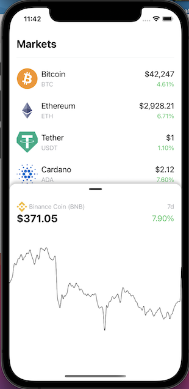

# Hack Technology / Project Attempted

## What you built? 

We built a crypto price tracker app in React Native which has a list of different crypto currencies and their 7 day change percentage. When you click select a currency, it brings up a bottom sheet which has an interactive graph that shows the price over time. We used reusable components for the list and API data for the currency information. To do so, we followed one tutorial to setup our workspace and learn a bit about React Native and expo as well as how to debug in mobile dev, and another tutorial which dove right in to creating the crypto price tracker app.  

Screenshots:

Main Page

Example Chart

## Who Did What?

We both followed the first tutorial together to set up our workspaces and understand how the simulators work. We then took turns coding for the second tutorial which showed us how to build the crypto price tracker app - Nina coded the first half (initial set up, creating the reusable components for the list with sample data, and creating an empty bottom sheet when clicking on a currency), and Matthew coded the second half (displaying the graph on the bottom sheet, connecting to the api and using this information to populate the list and graphs).

## What you learned

What worked: 
* Learned how to create reusable components
* Smaller specifics like making the list scroll nicely and using SafeAreaView
* Learned how to use axios to retreive data from coin gecko API 
* Learned how to include outside services like BottomSheet
* Learned about simulators and debugging

What didn't work:
* The workspace setup was pretty difficult and time-consuming and the first tutorial spent a lot of time talking about how to debug the code before we had even seen much of the React Native code, which we didn't find to be super helpful

In our opinion, the setup and the overall layout of the files with the separation of views seemed more intuitive with Swift, but we realized that React Native is probably a better choice for an app so that it can work with both iOS and Android. As we got further along with React Native, we appreciated the aspect of reusable components and the ease with which we could incorporate them into the list. It was also really cool to see how nicely we can space elements if we separate them into different views, and it was helpful to learn about some of the smaller aspects of the UI which make the app look much cleaner. We will probably use these smaller UI aspects as well as API calls and incorporating outside services like BottomSheet when creating our project.

## Authors

Nina Herman & Matthew Roth

## Acknowledgments

Tutorial 1 (workspace setup and learning about React Native/debugging): https://www.youtube.com/watch?v=0-S5a0eXPoc
Tutorial 2 (actually building the app - 3 parts): https://www.youtube.com/watch?v=0JG1_9xqC6A&list=PLYBvEAka-q1iX72JXlrEez7ko4X6nGZ9m&index=1, https://www.youtube.com/watch?v=IJQow77vvys&list=PLYBvEAka-q1iX72JXlrEez7ko4X6nGZ9m&index=3, https://www.youtube.com/watch?v=MIolL20o9GE&list=PLYBvEAka-q1iX72JXlrEez7ko4X6nGZ9m&index=4
